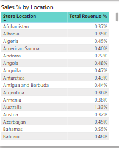
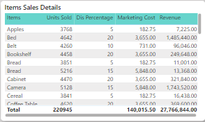

# SuperMarket Sales Dashboard

## Project Overview
The Supermarket Sales Dashboard aims to provide a comprehensive understanding of how discounts, marketing costs, and revenue trends behave at both item-level and category-level. The dashboard enables users to gain insights into sales performance, helping businesses make data-driven decisions.

### Dataset
- The initial dataset was sourced from **Kaggle**. After data manipulation, a new dataset was created by refining the sample for better insights.

### Features
- User-friendly, fully interactive dashboard.
- A fully functional database capable of collecting and processing both past and future data efficiently.

### Tech Stack
- **Excel**: Used for dividing and creating relational datasets.
- **Data Cleaning**: Utilized Python libraries like `pandas` and `numpy` to clean the dataset.
- **Data Manipulation**: Employed Python libraries (`pandas`, `numpy`) to manipulate data and prepare it for analysis.
- **PostgreSQL Database**: Used to store and maintain cleaned and manipulated data.
- **SQL**: Used to clean, summarize, and organize data for visualization.
- **Power BI**: Leveraged for building a fully functional and interactive visualization dashboard.
- **ChatGPT**: Utilized to solve complex problems faster, improving efficiency and project workflow.

### Problems in Company Decision-Making
- **How is revenue distributed?**
- **Is the discount range too low, or can it be adjusted?**
- **Is the marketing cost for items justified?**
- **Is it worth spending money on marketing for certain products?**

## Project Journey

1. **Dataset Challenges**:
   - Initially, I obtained a dataset from **Kaggle** to create this project. However, the dataset was a single file, making it difficult to practice creating relational datasets, which is essential for developing my skills.
   - To overcome this, I split the sample file into **three CSV files**, creating relational datasets by dividing data logically.

2. **Data Cleaning**:
   - I cleaned the data using Python libraries like **pandas** and **numpy**. This involved transforming columns such as product IDs, categories, items, and prices. Most of the data is now not only clean but also newly generated or modified.

3. **Database Creation**:
   - After cleaning the data, I set up a **PostgreSQL** database server locally. Using this setup, I created a relational database structure.
   - I then queried the data from the database, obtaining the necessary information to create visuals that would help managers, stockholders, and other decision-makers.

4. **Dashboard Development**:
   - The next step was to create a dashboard using **Power BI**. While I considered using **Tableau**, the public version did not support connecting to a PostgreSQL database.
   - Creating the Power BI dashboard was somewhat challenging due to query incompatibilities with PostgreSQL. Additionally, I couldn’t use map visualizations as the location data was spread across a global chain of supermarkets. Including such a map would have been distracting and time-consuming for users to navigate.

5. **Key Performance Indicators (KPIs)**:
   - The KPIs for this dashboard include:
     - **Total revenue** (excluding discounts)
     - **Average discount percentage**
     - **Units sold**
     - **Marketing cost**

6. **Dashboard Design**:
   - The dashboard is divided into **three tabs** to make it easy for users to interact with different slices of data.
   - For slicers, I included **Product Category**, **Year**, **Month**, and **Holiday Effect** to allow decision-makers to answer specific questions about the business effectively.

### Key Insights and Impact
By utilizing this dashboard, decision-makers can better understand how various factors like discounts and marketing impact the business, enabling more informed and strategic decisions.

### Issues I Faced Throughout the Project

1. **CTEs (Common Table Expressions) Performance**:
   - The first major issue I encountered was using multiple **CTEs** in queries, as both Power BI and PostgreSQL struggled to process them efficiently.
   - Example of a problematic query:
     ```sql
     with cte_rw as (
         select
             date,
             r.product_id,
             r.units_sold,
             c.price_per_unit,
             item,
             sales_revenue,
             r.units_sold * c.price_per_unit as raw_revenue
         from retail_sales r
         left join categories c on c.category_id = r.category_id
     ),
     cte_sel as (
         Sselect
             r.store_id,
             r.date,
             extract(year from r.date) as sales_year,
             case 
                when extract(month from r.date) = 1 then  'January'
                when extract(month from r.date) = 2 then 'February'
                when extract(month from r.date) = 3 then  'March'
                when extract(month from r.date) = 4 then 'April'
                when extract(month from r.date) = 5 then 'May'
                when extract(month from r.date) = 6 then 'June'
                when extract(month from r.date) = 7 then 'July'
                when extract(month from r.date) = 8 then 'August'
                when extract(month from r.date) = 9 then 'September'
                when extract(month from r.date) = 10 then 'October'
                when extract(month from r.date) = 11 then 'November'
                when extract(month from r.date) = 12 then 'December'
	         end as sales_month,
             r.product_id,
             c.item,
             r.units_sold,
             c.price_per_unit,
             rw.raw_revenue,
             r.discount_percentage,
             round(rw.raw_revenue * (1 - discount_percentage / 100.0)) as pure_revenue,
             r.category_id,
             c.product_category,
             store_location,
             r.day_of_the_week,
             r.holiday_effect
         from retail_sales r
         left join categories c on c.category_id = r.category_id
         join cte_rw rw on rw.product_id = r.product_id
     )
     select
         cs.store_id,
         cs.date,
         cs.sales_year,
         cs.sales_month,
         cs.product_id,
         cs.item,
         cs.units_sold,
         cs.price_per_unit,
         cs.discount_percentage,
         cs.pure_revenue,
         cs.category_id,
         cs.product_category,
         m.marketing_cost_per_item,
         cs.store_location,
         cs.day_of_the_week,
         cs.holiday_effect
     from cte_sel cs
     join marketing_cost m on m.category_id = cs.category_id;
     ```

   - **Solution**: After realizing that the CTEs were too heavy for the system, I initially tried using **temporary tables** to retrieve the same data, but this approach also failed. Eventually, I switched to using **subqueries** to reduce the workload, and this method worked effectively.

2. **Map Visualization**:
   - When I attempted to create a **map visualization** in Power BI, it didn’t work as expected. This was due to the extensive amount of data in the `location` column, which covered supermarket stores across the globe.
   - Using a map would have been distracting for users, as it resembled the experience of using **GeoGuessr**, rather than helping to focus on the main objectives of the dashboard.
   - **Solution**: I decided to use a **table view** for locations, allowing users to filter by location instead.
   
   

3. **Item Visualization**:
   - Visualizing more than 40 items from the database was impractical with charts or graphs. Representing all items in a meaningful way was a challenge.
   - **Solution**: I used a **table visualization** to list the items, enabling users to filter and sort as needed.

   

4. **Marketing Cost Calculation**:
   - Another issue arose when calculating **marketing costs**. The costs were calculated on a **per-unit basis**, and using this for further calculations resulted in incorrect values.
   - **Solution**: I had to rerun several queries to correctly aggregate the marketing costs and derive accurate data. Since I only recently learned SQL, this process involved some trial and error, but I’m satisfied with the outcome for now.

### Final Status
- After creating both the **dashboard** and the **database**, I successfully provided all the insights needed to address the key questions outlined in the **Problem in Company Decision-Making** section.

### What I Learned
- **Problem-Solving**: Developed strong problem-solving skills, especially when tackling complex SQL queries and data processing challenges.
- **Data Manipulation with Python**: Gained extensive experience in manipulating data using **pandas** and **numpy**, which allowed me to work flexibly with datasets.
- **SQL Functions**: Practiced using various **SQL functions** to solve real-world use cases, which enhanced my skills in database management.
- **Practical Visualizations in Power BI**: Learned how to create **practical, insightful visualizations** in Power BI, focusing on clarity and decision-making.
- **Maximizing Efficiency with AI**: Leveraged **AI tools**, such as ChatGPT, to enhance problem-solving speed and efficiency, especially when troubleshooting code and generating ideas.

### Contact
For any inquiries, please reach out to:

**Name**: Indumina Prabashwara  
**Email**: [induminaprabashwara3@outlook.com](mailto:induminaprabashwara3@outlook.com)
